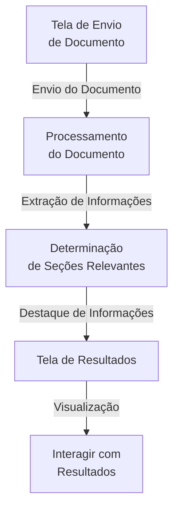
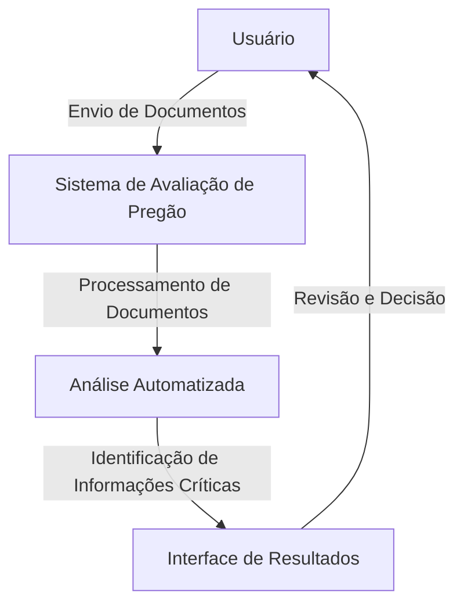

## AUTHFILE 🔎🔏🗒️
O AUTHFILE é um sistema web que tem como objetivo **identificar fraudes em licitações**. Para isso foi proposto um sistema que pudesse realizar essa análise e dar esse retorno fazendo uso de **Inteligência Artificial (IA)**.

### O problema 🚨
Comumente é notado que vários órgãos e empresas e processos licitatórios precisam lidar com a análise dos documentos envidados pelos inscritos e esse é um processo exaustivo pois existem diferentes tipos de licitações e para cada uma delas e necessário analisar uma série de aspectos para identificar se o documento em questão pode, ou não, ser fraudulento. Mais do que isso, é necessário uma analise minuciosa para que aquilo que seja apenas um **erro** no documento não seja dito como **fraude**.
No Sistema proposto será considerado apenas uma das modalidades de licitações existentes definidas pela *Lei 14.133 de 01 de Abril de 2021*, a modalidade **Pregão**. Escolhida de acordo com o tempo disponível pois tentar criar um sistema que pudesse avaliar todas as modalidades é um trabalho de um nível de complexidade muito elevado.

### Surgimento 💡
A ideia desse sistema surgiu como um desafio na disciplina *Análise e Projeto de Sistemas II* do curso de **Sistemas de Informação** do IFMA Campus São Luís - Monte Castelo, ministrada pelo professor Dr. Daniel Lima propondo que os alunos tenham uma imersão mais prática do que apenas teórica já que é uma disciplina do 6º período, caminhando para a reta final do curso que tem um total de 8 períodos.

### Fluxo de Execução 🔀📄
Abaixo temos um fluxograma mostrando as telas e suas funcionalidades

#### Interação com o Usuário 🔁📤🕵️
Este fluxo representa como um usuário interage com o sistema simulando um diagrama de caso de uso

### Ferramentas e Linguagens 🔗
>     
          
          
